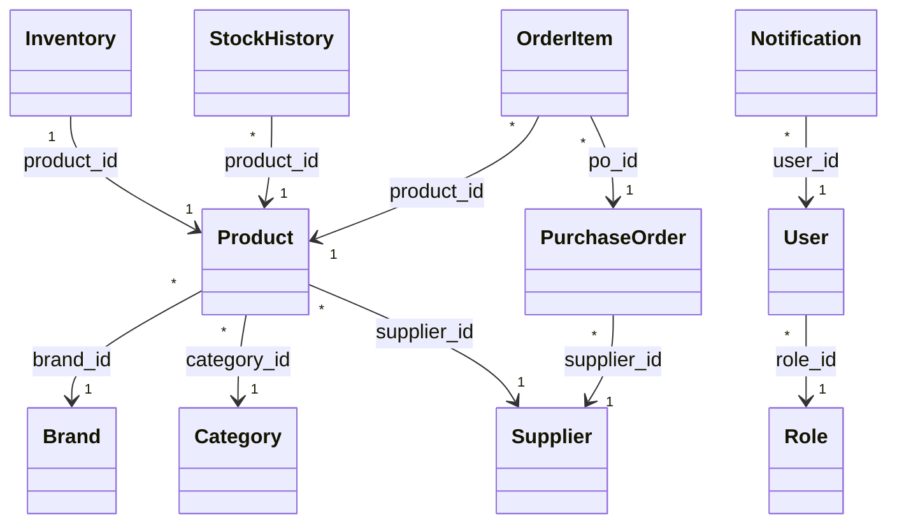

# BACKEND ARCHITECTURE PLAN: SupplySync Inventory & Order Management System

This document outlines the architecture, data models, package layout, security configurations, and API structures for the SupplySync Spring Boot backend.

---

## 1. Complete Backend Package Structure

The backend follows a layered, domain-driven clean architecture structure:

```
com.retail.inventory/
│
├── config/                      # System and framework configurations
│   ├── AppConfig.java           # General beans (BCrypt, ModelMapper)
│   ├── CorsConfig.java          # Cross-Origin Resource Sharing settings
│   └── SecurityConfig.java      # Spring Security & endpoint authorization config
│
├── security/                    # Authentication components
│   ├── CustomUserDetails.java   # Spring Security UserDetails implementation
│   ├── CustomUserDetailsService.java # User Details loader from database
│   ├── JwtAuthenticationFilter.java  # HTTP interceptor for token verification
│   └── JwtTokenProvider.java    # JWT generation, extraction, and validation
│
├── model/                       # JPA Database Entities
│   ├── Brand.java
│   ├── Category.java
│   ├── Inventory.java
│   ├── Notification.java
│   ├── OrderItem.java
│   ├── Product.java
│   ├── PurchaseOrder.java
│   ├── Role.java
│   ├── StockHistory.java
│   ├── Supplier.java
│   └── User.java
│
├── repository/                  # Database access interfaces (Spring Data JPA)
│   ├── BrandRepository.java
│   ├── CategoryRepository.java
│   ├── InventoryRepository.java
│   ├── NotificationRepository.java
│   ├── OrderItemRepository.java
│   ├── ProductRepository.java
│   ├── PurchaseOrderRepository.java
│   ├── RoleRepository.java
│   ├── StockHistoryRepository.java
│   ├── SupplierRepository.java
│   └── UserRepository.java
│
├── service/                     # Business logic layers (Interfaces & Impls)
│   ├── AuthService.java         # Registration, login logic
│   ├── DashboardService.java    # Role-based statistics calculation
│   ├── InventoryService.java    # Reconciliation, physical counts, stock moves
│   ├── NotificationService.java # Alert broadcasts and logs
│   ├── ProductService.java      # SKU scan and product catalog management
│   ├── PurchaseOrderService.java # Order approval flow & warehouse delivery
│   ├── ReportService.java       # PDF compilation and data export
│   └── UserService.java         # Account provisioning and security log auditing
│
├── controller/                  # REST Controllers exposing endpoints
│   ├── AuthController.java
│   ├── FinanceController.java
│   ├── StoreManagerController.java
│   ├── SuperAdminController.java
│   ├── SupplierController.java
│   └── WarehouseController.java
│
└── dto/                         # Data Transfer Objects (Payload models)
    ├── request/
    │   ├── LoginRequest.dto
    │   ├── ProductRequest.dto
    │   ├── PurchaseOrderRequest.dto
    │   ├── ReconciliationRequest.dto
    │   └── RegisterRequest.dto
    └── response/
        ├── AuthResponse.dto
        ├── DashboardStatsResponse.dto
        ├── InventorySummaryResponse.dto
        └── PurchaseOrderResponse.dto
```

---

## 2. Required JPA Entities

The JPA entities map directly to the PostgreSQL database tables defined in the database schema:



### Details of Entities:

*   **Role** (`roles` table):
    *   Fields: `Long id`, `String name`.
*   **User** (`users` table):
    *   Fields: `Long id`, `String username`, `String email`, `String passwordHash`, `String phone`, `Role role`, `LocalDateTime createdAt`.
*   **Category** (`categories` table):
    *   Fields: `Long id`, `String name`.
*   **Brand** (`brands` table):
    *   Fields: `Long id`, `String name`.
*   **Supplier** (`suppliers` table):
    *   Fields: `Long id`, `String name`, `String contactEmail`, `String phone`, `String address`, `LocalDateTime createdAt`.
*   **Product** (`products` table):
    *   Fields: `Long id`, `String name`, `Brand brand`, `Category category`, `String sku`, `Double price`, `Supplier supplier`, `String qrCodeData`, `String imageUrl`, `String description`, `LocalDateTime createdAt`.
*   **Inventory** (`inventory` table):
    *   Fields: `Long id`, `Product product` (One-to-One), `Integer quantity`, `Integer reorderLevel`, `LocalDateTime lastUpdated`.
*   **StockHistory** (`stock_history` table):
    *   Fields: `Long id`, `Product product`, `Integer changeQty`, `String actionType` (ADD, REMOVE, UPDATE), `LocalDateTime timestamp`.
*   **PurchaseOrder** (`purchase_orders` table):
    *   Fields: `Long id`, `Supplier supplier`, `String status` (PENDING, APPROVED, DELIVERED, CANCELLED), `LocalDate orderDate`, `LocalDate deliveryDate`, `Double totalAmount`, `List<OrderItem> items`.
*   **OrderItem** (`order_items` table):
    *   Fields: `Long id`, `PurchaseOrder purchaseOrder`, `Product product`, `Integer quantity`, `Double unitPrice`.
*   **Notification** (`notifications` table):
    *   Fields: `Long id`, `User user`, `String message`, `String type` (ALERT, SUCCESS, UPDATE), `Boolean isRead`, `LocalDateTime createdAt`.

---

## 3. Repository Interfaces

All interfaces extend `JpaRepository<Entity, Long>`.

| Repository | Queries / Custom Query Methods |
| :--- | :--- |
| **UserRepository** | `Optional<User> findByUsername(String username)`<br>`Optional<User> findByEmail(String email)` |
| **RoleRepository** | `Optional<Role> findByName(String name)` |
| **ProductRepository** | `Optional<Product> findBySku(String sku)`<br>`List<Product> findByCategoryName(String cat)`<br>`List<Product> findByNameContainingIgnoreCase(String name)` |
| **InventoryRepository** | `Long countByQuantityGreaterThan(int qty)`<br>`@Query("SELECT COUNT(i) FROM Inventory i WHERE i.quantity <= i.reorderLevel") Long countLowStock()` |
| **StockHistoryRepository** | `List<StockHistory> findByProductOrderByTimestampDesc(Product product)` |
| **PurchaseOrderRepository** | `List<PurchaseOrder> findBySupplier(Supplier supplier)`<br>`List<PurchaseOrder> findByStatus(String status)` |
| **NotificationRepository** | `List<Notification> findByUserIdOrderByCreatedAtDesc(Long userId)`<br>`Long countByUserIdAndIsReadFalse(Long userId)` |

---

## 4. Service Classes

### AuthService
*   **Purpose**: Manages credential checks, register operations, and security context initialization.
*   **Dependencies**: `UserRepository`, `RoleRepository`, `JwtTokenProvider`, `AuthenticationManager`, `PasswordEncoder`.
*   **Database Tables**: `users`, `roles`.

### ProductService
*   **Purpose**: Catalog inventory listings, registers SKU scan lookups, and creates products.
*   **Dependencies**: `ProductRepository`, `BrandRepository`, `CategoryRepository`, `SupplierRepository`.
*   **Database Tables**: `products`, `brands`, `categories`, `suppliers`.

### InventoryService
*   **Purpose**: Deducts levels during dispatch, monitors reorder warnings, updates physical counts.
*   **Dependencies**: `InventoryRepository`, `ProductRepository`, `StockHistoryRepository`, `NotificationService`.
*   **Database Tables**: `inventory`, `products`, `stock_history`.

### PurchaseOrderService
*   **Purpose**: Generates orders, controls finance review workflow, commits items to inventory upon arrival.
*   **Dependencies**: `PurchaseOrderRepository`, `OrderItemRepository`, `InventoryService`, `NotificationService`.
*   **Database Tables**: `purchase_orders`, `order_items`, `inventory`.

---

## 5. Controller Classes & Endpoints

### 🔑 AuthController
*   **API Endpoints**:
    *   `POST /api/auth/login` - Validates credentials; returns JWT.
    *   `POST /api/auth/register` - Registers new user with custom roles.

### 💼 StoreManagerController
*   **API Endpoints**:
    *   `GET /api/store-manager/dashboard/stats` - Fetches manager metrics.
    *   `GET /api/store-manager/dashboard/notifications` - Lists manager alerts.
    *   `GET /api/store-manager/products` - Returns product list.
    *   `POST /api/store-manager/products` - Registers new item catalog.
    *   `GET /api/store-manager/products/scan/{sku}` - Performs barcode scans.
    *   `GET /api/store-manager/inventory/summary` - Gets aggregate stock counts.
    *   `GET /api/store-manager/orders` - Lists purchase orders.
    *   `POST /api/store-manager/orders` - Submits a new purchase request.
    *   `GET /api/store-manager/reports/generate-pdf` - Outputs report PDF files.

### 📦 WarehouseController
*   **API Endpoints**:
    *   `GET /api/warehouse/dashboard/stats` - Stock capacity stats.
    *   `POST /api/warehouse/stock-receipt` - Receives order packages.
    *   `POST /api/warehouse/stock-count` - Enters physical stock records.
    *   `PUT /api/warehouse/reconciliation` - Resolves system discrepancies.
    *   `POST /api/warehouse/dispatch` - Tracks items sent to storefronts.

### 💵 FinanceController
*   **API Endpoints**:
    *   `GET /api/finance/dashboard/stats` - Balance sheet indicators.
    *   `GET /api/finance/orders/pending` - Lists orders awaiting approval.
    *   `PUT /api/finance/orders/{id}/approve` - Authorizes payment.
    *   `PUT /api/finance/orders/{id}/reject` - Rejects purchase request.
    *   `GET /api/finance/valuation` - Calculates inventory asset costs.

### 🚚 SupplierController
*   **API Endpoints**:
    *   `GET /api/supplier/orders` - Fetches requests assigned to supplier.
    *   `PUT /api/supplier/orders/{id}/status` - Dispatches shipments, changes ETA.
    *   `POST /api/supplier/invoices` - Bills finance department.

### 🛡️ SuperAdminController
*   **API Endpoints**:
    *   `GET/POST/PUT/DELETE /api/admin/users` - Controls system accounts.
    *   `GET /api/admin/audit-logs` - Inspects transactions.

---

## 6. DTO Classes (Data Transfer Objects)

| DTO | Fields | Purpose |
| :--- | :--- | :--- |
| **LoginRequest** | `String usernameOrEmail`, `String password` | Ingestion of credentials |
| **AuthResponse** | `String token`, `String username`, `String role` | Token and profile return payload |
| **ProductRequest** | `String name`, `Long brandId`, `Long categoryId`, `String sku`, `Double price` | Handles catalog registry forms |
| **PurchaseOrderRequest** | `Long supplierId`, `List<OrderItemDTO> items` | Submits purchase orders |
| **ReconciliationRequest** | `Long productId`, `Integer physicalQty`, `String reason` | Logs stock audit results |

---

## 7. Authentication & Authorization Design

### Web Security Architecture
The security system utilizes **Spring Security 6.x** configured as a stateless filter chain.

```
Incoming Request
       │
       ▼
┌─────────────────────────────┐
│  JwtAuthenticationFilter    │  <--- Extracts & verifies token, builds
└──────────────┬──────────────┘       SecurityContext Authentication
               │
               ▼
┌─────────────────────────────┐
│  UsernamePasswordAuthFilter  │  <--- Fallback / Login checks
└──────────────┬──────────────┘
               │
               ▼
┌─────────────────────────────┐
│   AuthorizationManager      │  <--- Role check matching patterns
└──────────────┬──────────────┘
               │
               ▼
       Target Controller
```

### JWT Flow (Stateless Sessions)
1.  **Request Credentials**: Client posts credentials (`LoginRequest`) to `/api/auth/login`.
2.  **Generate Token**: Server validates matching database users, uses `JwtTokenProvider` to create a signed JSON Web Token with user claims:
    ```json
    {
      "sub": "johndoe",
      "role": "STORE_MANAGER",
      "exp": 1718388000
    }
    ```
3.  **Return Token**: Client receives token in `AuthResponse` and stores it locally.
4.  **Authorized Communication**: For every secured request, client includes the token in the headers:
    `Authorization: Bearer <token>`
5.  **Filter Validation**: `JwtAuthenticationFilter` intercepts the request, decodes the token signature, sets security context authorities, and routes the request.

### Role-Based Access Control (RBAC)
Method-level security is enabled on all controllers using `@EnableMethodSecurity`.

1.  **Map DB Roles**: Roles in database (prefixed with `ROLE_` e.g., `ROLE_STORE_MANAGER`) map directly to user authorities.
2.  **Controller Security**: Methods are annotated to restrict unauthorized clients:
    *   *Store Manager*: `@PreAuthorize("hasRole('STORE_MANAGER')")`
    *   *Warehouse*: `@PreAuthorize("hasRole('WAREHOUSE')")`
    *   *Finance*: `@PreAuthorize("hasRole('FINANCE')")`
    *   *Supplier*: `@PreAuthorize("hasRole('SUPPLIER')")`
    *   *Admin*: `@PreAuthorize("hasRole('SUPER_ADMIN')")`
3.  **Route Protection**: URL path filters are configured in the `SecurityFilterChain` bean:
    ```java
    http.authorizeHttpRequests(auth -> auth
        .requestMatchers("/api/auth/**").permitAll()
        .requestMatchers("/api/admin/**").hasRole("SUPER_ADMIN")
        .anyRequest().authenticated()
    );
    ```
